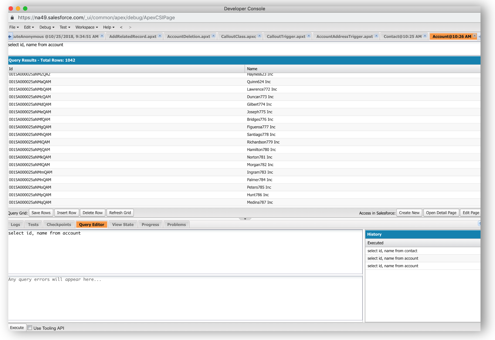
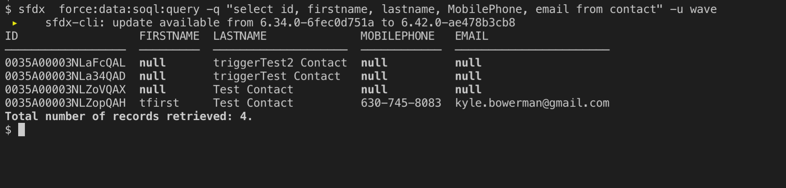

## Step 1:  Install SFDX and connect to an dev org.

## Step 2: Use your favorite SOQL tool to get a list of accounts.

 

good we have some accounts.   Now look for contacts.  
 

Oh Shoot it looks like we have some work to do.  Lets start with a NodeJS script to randomly make some names.  Lets assume you have node js installed and you are somewhat familar with the package manager called npm.

We are going to install a syntetehic data generator called [fakerJS](https://github.com/marak/Faker.js/) and a date library that will help us with date time format called moment.  But first lets stub out a package.json file so we can track our dependcies, and then install faker and moment

```
npm init
npm install faker moment --save
```

Now lets great a file called newNames.js, and include our 2 libraries:

```javascript
var faker = require('faker');
var moment = require('moment');
```
and add the following line:
```javascript
console.log("A fake name is ", faker.name.findName() );
```
and run the file with node newNames.js.  You should see something like this. 

 

Ok now we are cooking with gas,  Lets add a couple more fields and run it in a loop.   Replace the console.log with this block

```javascript
//First we need to print the header 
console.log('FirstName,LastName,MobilePhone,email')

//Then Loop through and create the rows.
for ( i=0; i<99; i++ ){
    firstname = faker.name.firstName();
    lastname = faker.name.lastName();
    MobilePhone = faker.phone.phoneNumberFormat();
    email = faker.internet.email( firstname, lastname,"example.com");
    output = [firstname, lastname, MobilePhone, email];
    console.log(output.toString());
};
```
Now we can run it and redirect the output to a csv file:

```node newNames.js > newcontacts.csv```

and we should get something like this, note there are no spaces after the comma in the header.


Now we have a sample file,  lets use sfdx to import the new synthetic contacts.  But before we do that lets use sfdx to query and show our contacts are nearly empty.   Note that 'wave' is the alias for the user and my org.

```
sfdx  force:data:soql:query -q "select id, firstname, lastname, MobilePhone, email from contact" -u wave
```


Ok good, I am in the right org and just 4 contacts.  Now lets run the sfdx command to import the data.

 ```
 sfdx force:data:bulk:upsert -f newcontacts.csv -s contact -i Id -w 2 -u wave
 ```
 and you should see something like this: 

 

 We can even use sfdx to see if the records are really there.   Just use the same line from above.  ```sfdx  force:data:soql:query -q "select id, firstname, lastname, MobilePhone, email from contact" -u wave``` 

 

 We see the 100 new contact there so lets modify this query to just get the contacts we created today and  slightly so we can export it to csv.  We just need to add ```-r csv``` to the end to format the output to csv.
 
 ```sfdx  force:data:soql:query -q "select id, firstname, lastname, MobilePhone, email from contact where createddate=TODAY" -u wave  -r csv  > todaysSFDCContacts.csv ```

Notice that query also gives us the Ids which we will need later.  So lets do the same thing to the Accounts so we can assgin the Contacts to Account.   First lets just get the accounts and throw the names in there for fun.  

```
sfdx  force:data:soql:query -q "select id, name from account" -u wave -r csv > accounts.csv
```

Before we assign these contact to accounts lets use faker again add a random picklist value (Department: Sales, Accounting, or Warehouse)  and a date, specificly birthdate.   Lets start a new file called ```assignFields.js``` we need to add a few more libraries to open read from a file.  Also lets create an array for the department that we will randomly select.

```
var faker = require('faker');
var  moment = require('moment');
var  fs = require('fs');
var  readline = require('readline');

var department = [ 'Sales' , 'Accounting' , 'Warehouse' ];
```

Next we add logic to create a file stream and read from our contact file.
```
var rd = readline.createInterface({
    input: fs.createReadStream('todaysSFDCContacts.csv'),
});
```
The line above creates file stream from the contact file ('todaysSFDCContacts.csv') we pulled from Salesforce.  We are going to loop through this file and write each line to the console but will add our two new fields: Deparment and birthdate.  We already have a column header row on the input file but we are going to skip it and just write a new column header before we loop through.

```
console.log("Id,FirstName,LastName,MobilePhone,Email,Birthdate,Department");
```
Relasticly we are going to do an update so we only need the Id and the new fields but for simplitisty we will leave the old row as is.  Here is the iterator block that starts by initilizeing a line counter. 

```javascript
var lineumber =1;
rd.on('line', function(line) {
    // choose a date in the past starting for 1/1/2001 going back as much as 70 years
    mydate = faker.date.past(70, '2000-01-01');
    formattedBirthDate = moment(mydate).format("YYYY-MM-DD"); 
    rowDepartment = faker.random.arrayElement(departmentPicklist);
    
    if(lineumber > 1 ) {
        output = [line, formattedBirthDate, rowDepartment]
        console.log(output.toString() );
    }

    lineumber++;
});
```
The 'on' method of the readline library is a built in iterator and takes a variable for the iterator name ```line```  and then the call back.  If the linenumber is greater than 1 (quick way to skip the old header) the output array is written to the consloe.  We can redirect the console to a output file that we then send to Salesforce.

```
node assignFields.js  > updateContacts.csv
sfdx force:data:bulk:upsert -f updateContacts.csv -s Contact -i Id -w 2 -u wave
```
and we can use sfdx to show the new results:
```
sfdx  force:data:soql:query -q "select id, firstname, lastname, MobilePhone, email, department, birthdate from contact" -u wave
```
 

Yup!   Looks good.


## Other Unix goodiess
1. head: select the top x lines of a file
1. gshuf - shuffles the rows of a file,  good to be ued with head to get a random sampling