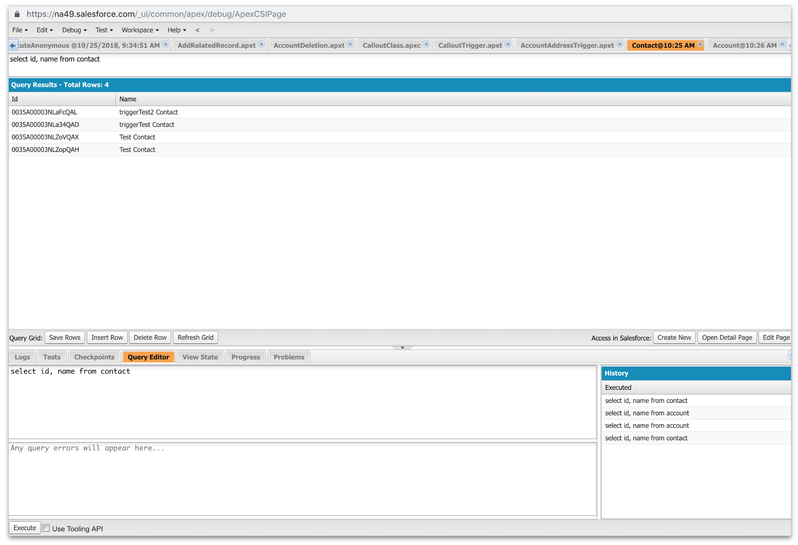

## Step 1:  Install SFDX and connect to an dev org.

## Step 2: Use your favorite SOQL tool to get a list of accounts.

 

good we have some accounts.   Now look for contacts.  
 

Oh Shoot it looks like we have some work to do.  Lets start with a NodeJS script to randomly make some names.  Lets assume you have node js installed and you are somewhat familar with the package manager called npm.

We are going to install a syntetehic data generator called [fakerJS](https://github.com/marak/Faker.js/) and a date library that will help us with date time format called moment.  But first lets stub out a package.json file so we can track our dependcies, and then install faker and moment

```
npm init
npm install faker moment --save
```

Now lets great a file called newNames.js, and include our 2 libraries:

```javascript
var faker = require('faker');
var moment = require('moment');
```
and add the following line:
```javascript
console.log("A fake name is ", faker.name.findName() );
```
and run the file with node newNames.js.  You should see something like this. 

 

Ok now we are cooking with gas,  Lets add a couple more fields and run it in a loop.   Replace the console.log with this block

```javascript
//First we need to print the header 
console.log('FirstName,LastName,MobilePhone,email')

//Then Loop through and create the rows.
for ( i=0; i<99; i++ ){
    firstname = faker.name.firstName();
    lastname = faker.name.lastName();
    MobilePhone = faker.phone.phoneNumberFormat();
    email = faker.internet.email( firstname, lastname,"example.com");
    output = [firstname, lastname, MobilePhone, email];
    console.log(output.toString());
};
```
Now we can run it and redirect the output to a csv file:

```node newNames.js > newcontacts.csv```

and we should get something like this, note there are no spaces after the comma in the header.


Now we have a sample file,  lets use sfdx to import the new synthetic contacts.  But before we do that lets use sfdx to query and show our contacts are nearly empty.   Note that 'wave' is the alias for the user and my org.

```
sfdx  force:data:soql:query -q "select id, firstname, lastname, MobilePhone, email from contact" -u wave
```


Ok good, I am in the right org and just 4 contacts.  Now lets run the sfdx command to import the data.

 ```
 sfdx force:data:bulk:upsert -f newcontacts.csv -s contact -i Id -w 2 -u wave
 ```
 and you should see something like this: 

 

 We can even use sfdx to see if the records are really there.   Just use the same line from above.  ```sfdx  force:data:soql:query -q "select id, firstname, lastname, MobilePhone, email from contact" -u wave``` 

 

 We see the 100 new contact there so lets modify this query to just get the contacts we created today and  slightly so we can export it to csv.  We just need to add ```-r csv`` to the end to format the output to csv.
 ```sfdx  force:data:soql:query -q "select id, firstname, lastname, MobilePhone, email from contact where createddate=TODAY" -u wave  -r csv  > todaysSFDCContacts.csv ```
Notice that query also gives us the Ids which we will need later.  So lets do the same thing to the Accounts so we can assgin the Contacts to Account.   First lets just get the accounts and throw the names in there for fun.  

```
sfdx  force:data:soql:query -q "select id, name from account" -u wave -r csv > accounts.csv
```


